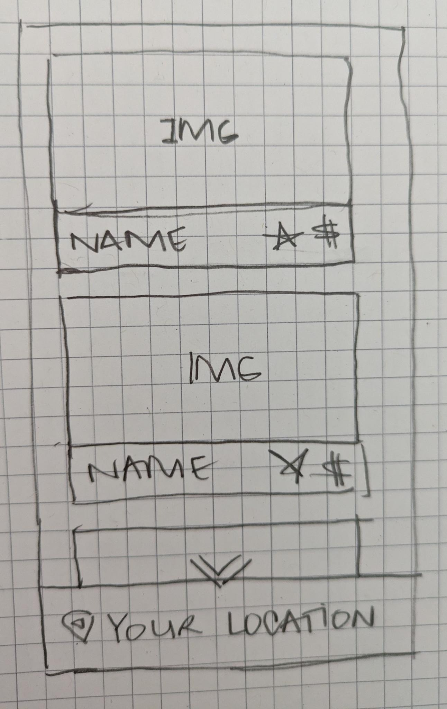

# Places Family App

This app was developed as a part of the [WWCode App Deploy Hackathon in Partnership with Google Play](https://hopin.com/events/wwcode-app-deploy/registration). The hackathon required participants to build an Android application using a Google API. It took place from 17-20 November 2023.

## 🛠️ Technologies

## 🤔 Reflection

This is the first app I've tried building with Android Studio beyond some simple static layout practice exercises, and it's been such a good learning experience!

### 💡 Thoughts after Day 1 of hackathon

Whew! I've been plugging away at this little app idea for the first day of the hackathon, and I just wanted to share some thoughts at this point in the process.

- Sometimes I feel like a true beginner. And other times I feel like I've been working in development for a while.
- Debugging and troubleshooting, in general, are much easier and less daunting and panic-inducing than they used to be. Solving mysteries is what this is all about.
- It can take a long time to get things set up/scaffolded/configured, especially when using a new medium.
- It's exciting to see similarities between web and Android development. Some of the concepts are similar, and it helps knowing a bit about web development to grasp concepts in Android development.
- Vocabulary is a challenge sometimes. When learning a new domain (Android development in this case), all of the vocabulary is new. So ideas that are the same or similar in web development are called different things. Getting it all straight is a process.
- Being persistent pays off, in one way or another, eventually.
- Learning is a continuous process.

### ✅ Day 1 Tasks

Most of Day 1 was spent doing one of two things: brainstorming/planning or scaffolding the project.

I did some initial brainstorming, and narrowed down a couple of app ideas. Then after looking at the Google API documentation, I chose one of the ideas to run with. My app idea is to use the Google Place API to create an app for families exploring a new location.

I want to create an app that uses the current location to simply display top rated attractions (entertainment & recreation, sports) in area so families can quickly see what is nearby and choose what to visit next.

However, this is the first Android app I'm attempting to build, so there's a lot to learn! So I opted to simplify the app idea as much as possible and see if I can get everything connected.

#### Must-Have Features

- Access Google Place details
  -- Filter attractions based on type (tourist-attraction, park, museum, etc)
- Render image, place name, rating, cost for nearby attractions
- Scrollable list of nearby places

#### Nice-to-Have Features / Future Directions

- Access current location of device
- Ability to manually enter address
- Get route from current location to destination (click on attraction)
- Filter places by “family-friendly status” – supplement with data from Yelp or other api
- Save location to personal list
- Save notes or pictures or other information about attractions
- Authentication and authorization for user accounts

My initial wireframes were done on paper, and I used Figma to make a simple, slightly higher fidelity mock up of the app.

### ✅ Day 2 Tasks
